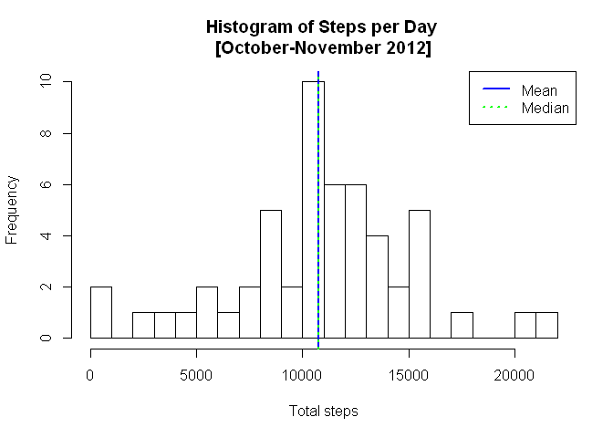
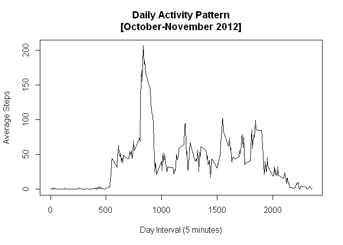
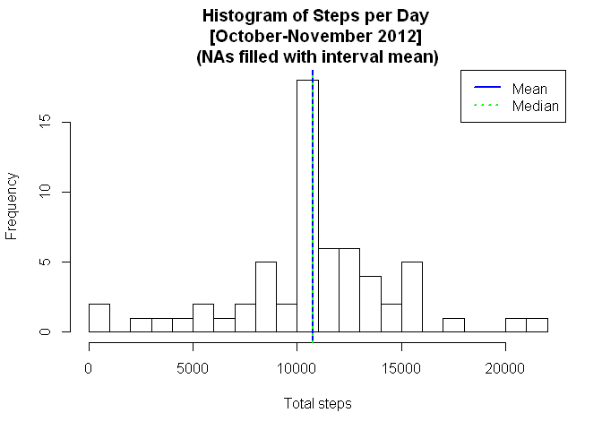
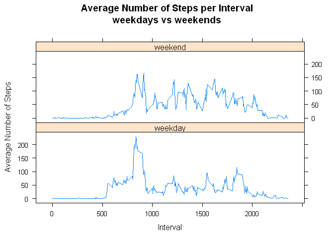

# Reproducible Research: Peer Assessment 1
##Introduction
It is now possible to collect a large amount of data about personal movement using activity monitoring devices such as a Fitbit, Nike Fuelband, or Jawbone Up. These type of devices are part of the "quantified self" movement - a group of enthusiasts who take measurements about themselves regularly to improve their health, to find patterns in their behavior, or because they are tech geeks. But these data remain under-utilized both because the raw data are hard to obtain and there is a lack of statistical methods and software for processing and interpreting the data.

This assignment makes use of data from a personal activity monitoring device. This device collects data at 5 minute intervals through out the day. The data consists of two months of data from an anonymous individual collected during the months of October and November, 2012 and include the number of steps taken in 5 minute intervals each day.

##Data
**Dataset file:** Link to the .zip file containing the .csv file used [Activity Monitoring](https://d396qusza40orc.cloudfront.net/repdata%2Fdata%2Factivity.zip) 

**Variables:**

* steps: Number of steps taking in a 5-minute interval (missing values are coded as NA) 
* date: The date on which the measurement was taken in YYYY-MM-DD format 
* interval: Identifier for the 5-minute interval in which measurement was taken

## Loading and preprocessing the data
First of all we will load all the required librarys that we will be using through the assignment(data.table, lattice).Then we unzip the [downloaded compressed file](https://d396qusza40orc.cloudfront.net/repdata%2Fdata%2Factivity.zip), and  read the activity.csv into tblActivity.

```r
unzip("activity.zip")
require(data.table)
```

```
## Loading required package: data.table
```

```r
require(lattice)
```

```
## Loading required package: lattice
```

```r
tblActivity<-as.data.table(read.csv("activity.csv"))
```

## What is mean total number of steps taken per day?
For this part of the assignment we discard the rows of the dataset where steps is NA. We sum the steps by date, and then generate an histogram where we have added the mean(blue) and the median(green).

```r
StepsPerDate<-tblActivity[!is.na(steps),list(steps=sum(steps)),by='date']
hist(StepsPerDate$steps
     ,main="Histogram of Steps per Day \n[October-November 2012]"
     ,xlab="Total steps"
     ,ylab="Frequency"
     ,breaks=30)
abline(v=mean(StepsPerDate$steps),col="blue",lty=1,lwd=2)
abline(v=median(StepsPerDate$steps),col="green",lty=3,lwd=2)
legend(x="topright",legend=c("Mean","Median"),lty=c(1,3),lwd=c(2,2),col=c("blue","green"))
```

 

The mean of the total steps taken per day is: 

```r
mean(StepsPerDate$steps)
```

```
## [1] 10766.19
```
The median of the total steps taken per day is: 

```r
median(StepsPerDate$steps)
```

```
## [1] 10765
```

## What is the average daily activity pattern?


```r
AvgStepsPerInterval<-tblActivity[!is.na(steps),list(avgsteps=mean(steps)),by='interval']
with(AvgStepsPerInterval
     ,plot(x=interval
           ,y=avgsteps
           ,type="l"
           ,main="Daily Activity Pattern\n[October-November 2012]"
           ,xlab="Day Interval (5 minutes)"
           ,ylab="Average Steps")
     )
```

 

The 5-minute interval than on average across all the days in the dataset,
contains the maximum number of steps is:

```r
AvgStepsPerInterval[AvgStepsPerInterval$avgsteps==max(AvgStepsPerInterval$avgsteps)
                    ,interval]
```

```
## [1] 835
```

## Imputing missing values
The total numer of rows where steps is NA is:

```r
sum(is.na(tblActivity$steps))
```

```
## [1] 2304
```
We fill the missing data using the average steps in the interval for all days.

```r
tblActivityNoNA<-merge(tblActivity,AvgStepsPerInterval,by="interval")
tblActivityNoNA$steps[is.na(tblActivityNoNA$steps)]<-
        as.integer(round(tblActivityNoNA$avgsteps[is.na(tblActivityNoNA$steps)]))
originalDatasetNames <- names(tblActivity)
tblActivityNoNA<-tblActivityNoNA[,originalDatasetNames,with=FALSE]
```

One filled the missing data we do an histogram of the total steps per day

```r
StepsNoNAPerDate<-tblActivityNoNA[!is.na(steps),list(steps=sum(steps)),by='date']
hist(StepsNoNAPerDate$steps
     ,main="Histogram of Steps per Day \n[October-November 2012] \n(NAs filled with interval mean)"
     ,xlab="Total steps"
     ,ylab="Frequency"
     ,breaks=30)
abline(v=mean(StepsPerDate$steps),col="blue",lty=1,lwd=2)
abline(v=median(StepsPerDate$steps),col="green",lty=3,lwd=2)
legend(x="topright",legend=c("Mean","Median"),lty=c(1,3),lwd=c(2,2),col=c("blue","green"))
```

 

The mean of the total steps taken per day with the filled data is: 

```r
mean(StepsNoNAPerDate$steps)
```

```
## [1] 10765.64
```
The median of the total steps taken per day is: 

```r
median(StepsNoNAPerDate$steps)
```

```
## [1] 10762
```

As can be seen the effect of the filling strategy is very low. We are filling approximately an 13% of the dataset, with average per interval data of nearly 87% of the total initial rows. 

## Are there differences in activity patterns between weekdays and weekends?

We create a new factor variable 'weekpart' in the dataset with two levels - "weekday" and "weekend" indicating whether a given date is a weekday or weekendday.

```r
Sys.setlocale("LC_ALL","English")
```

```
## [1] "LC_COLLATE=English_United States.1252;LC_CTYPE=English_United States.1252;LC_MONETARY=English_United States.1252;LC_NUMERIC=C;LC_TIME=English_United States.1252"
```

```r
tblActivityNoNA$weekpart<-"weekday"
tblActivityNoNA$weekpart[weekdays(as.Date(tblActivityNoNA$date)) %in% c("Saturday", "Sunday")]<-"weekend"
tblActivityNoNA$weekpart<- as.factor(tblActivityNoNA$weekpart)
```

Now we create a table of the average steps by weekpart,interval and make a panel plot using lattice

```r
AvgStepPerIntervalAndWeekpart<-tblActivityNoNA[,list(avgsteps=mean(steps)),by="interval,weekpart"]
xyplot(data=AvgStepPerIntervalAndWeekpart
       ,x=avgsteps~interval|weekpart
       ,type="l"
       ,layout = c(1,2),
        main = "Average Number of Steps per Interval\nweekdays vs weekends",
        xlab = "Interval",
        ylab = "Average Number of Steps"
)
```

 
